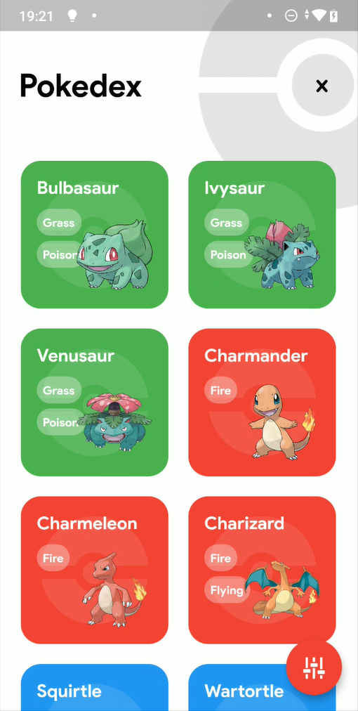
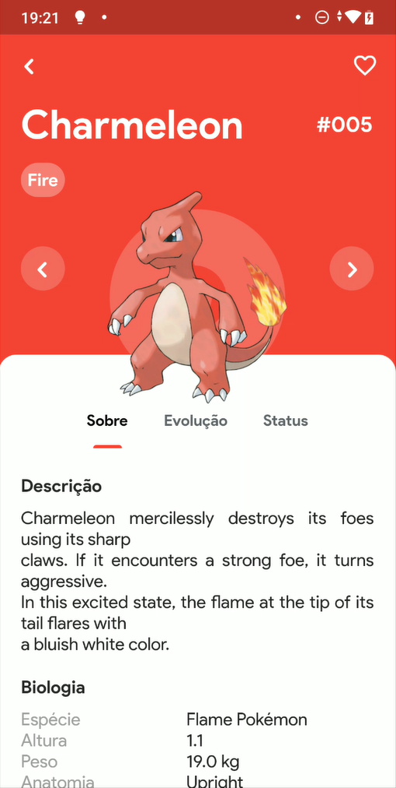
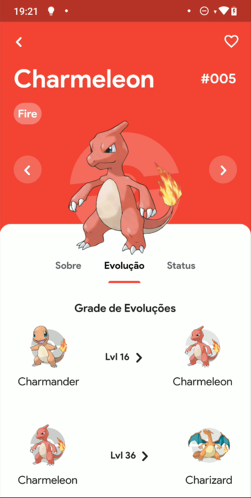
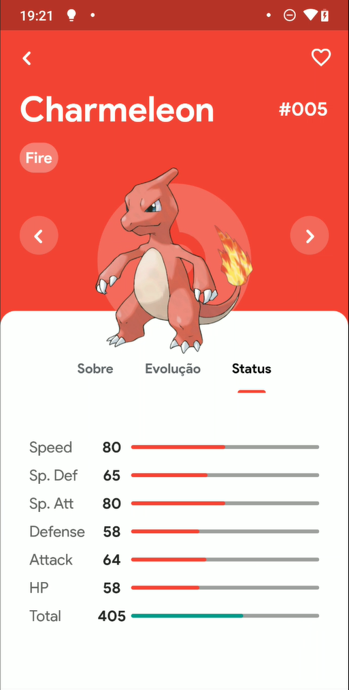

### ❓ Pokedex Flutter/MobX

- App feito com gerência de estado utilizando MobX e com gerência de instancias utilizando a biblioteca GetIt.
### ⚠️ Features

- Listagem de Pokemons
- Tela de Detalhes do Pokemon (Detalhes, Status, Evoluções)
## 📱 Current state

<code>

</code>
<code>

</code>
<code>

</code>

<code>

</code>

## 📌 Find me!
<!-- - Linkedin: https://www.linkedin.com/in/FranklysG19/ -->
- Instagram: https://www.instagram.com/franklysg/
- Github: https://github.com/FranklysG